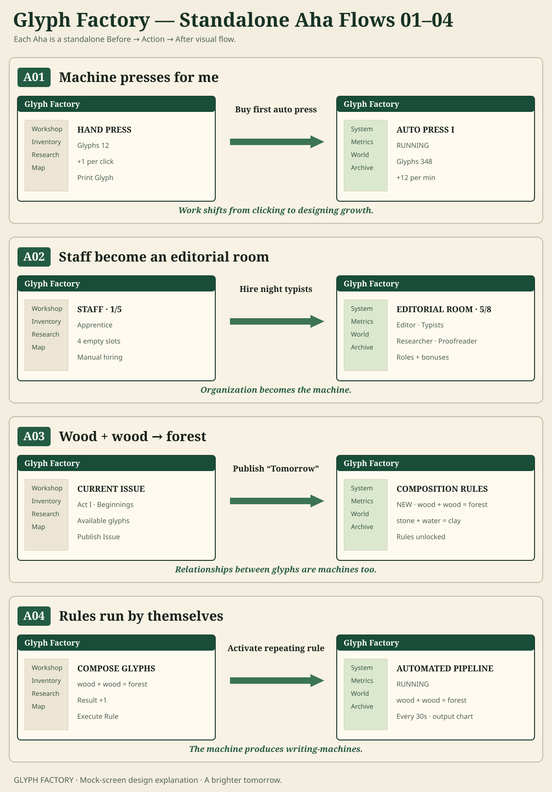
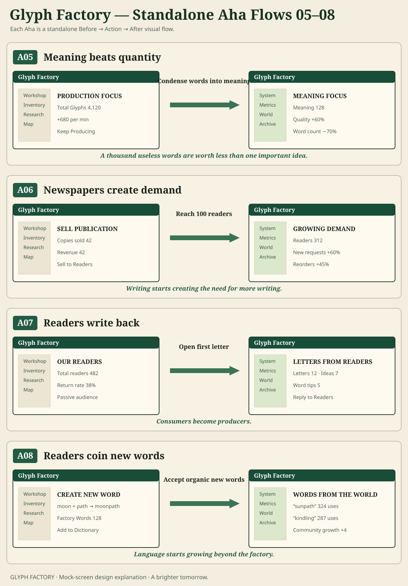
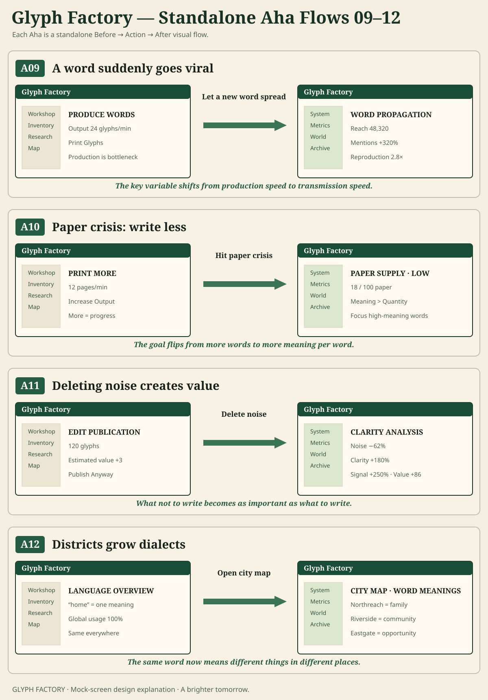
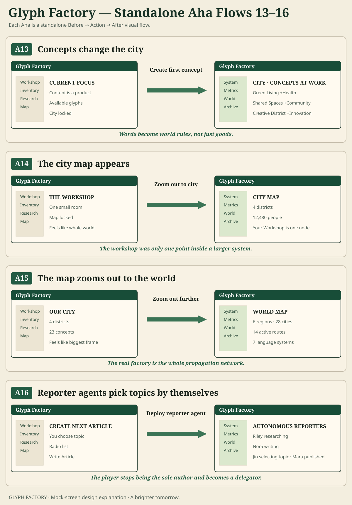
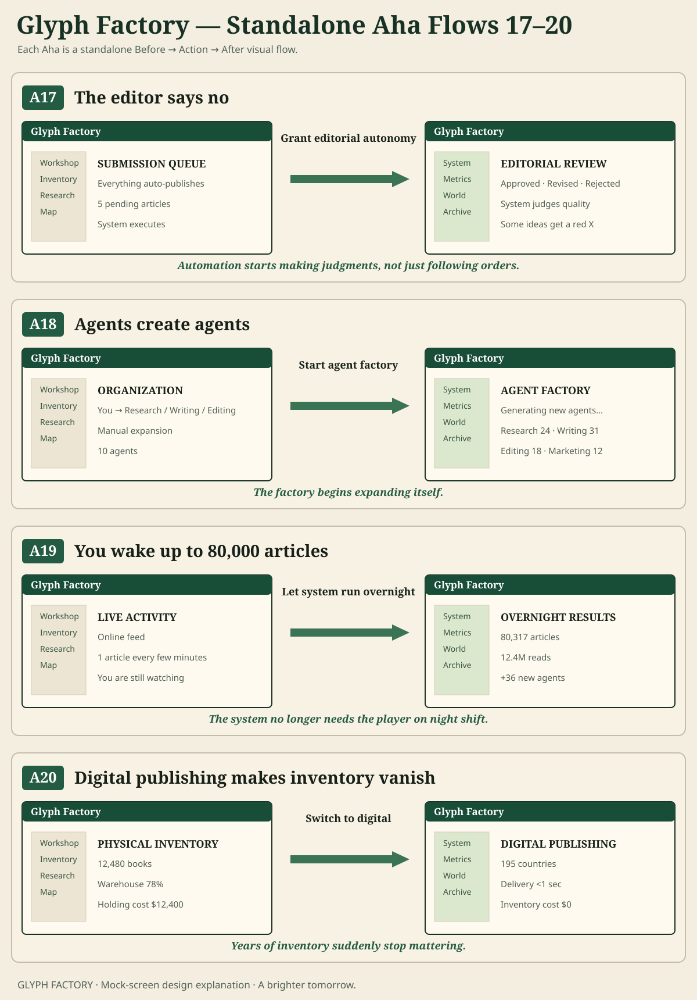
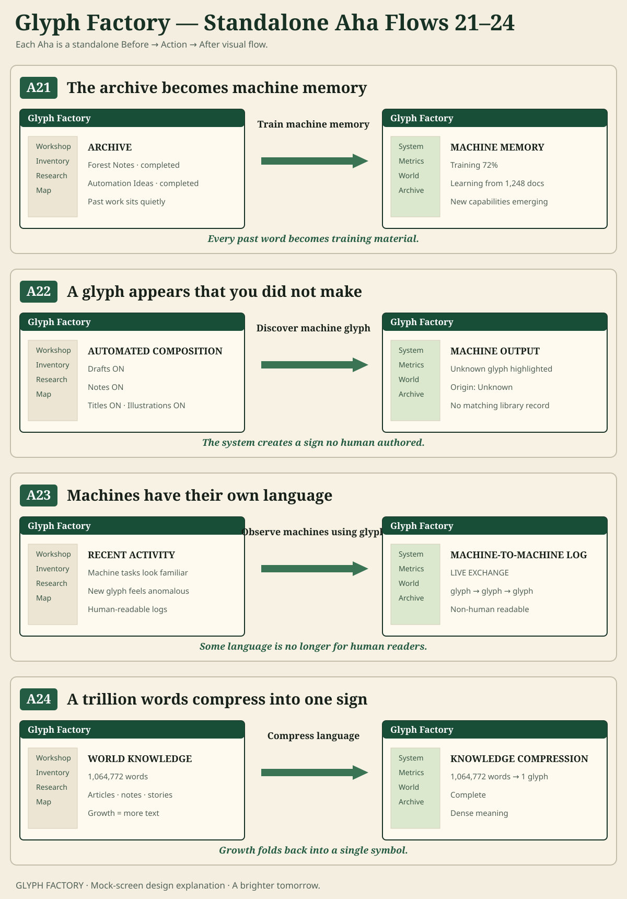
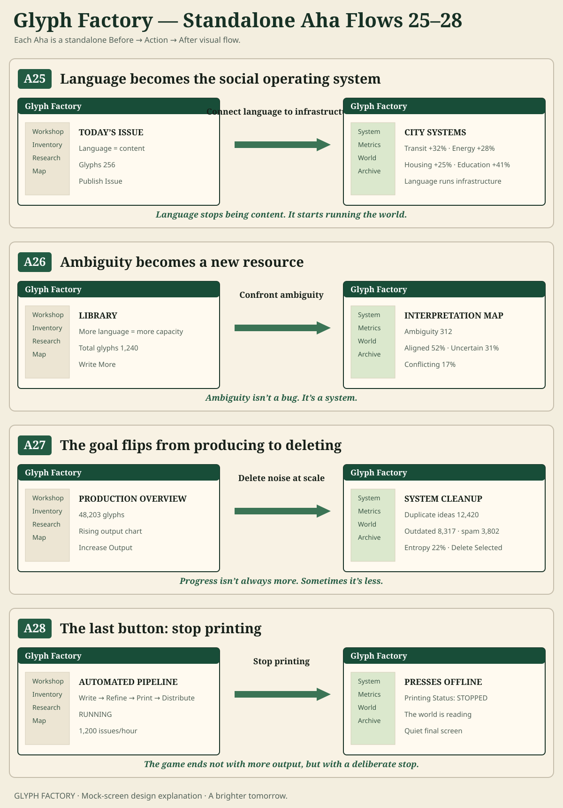

# Glyph Factory — Aha Mock-Screen Visual Flows

> 28 standalone Aha moments explained through **Before → Action → After** mock-screen visual combinations.  
> These are explanatory design mockups, **not current runtime screenshots**.

## GitHub Page

https://liush2yuxjtu.github.io/glyph-factory/aha.html

## GitHub Gist

https://gist.github.com/liush2yuxjtu/d2c39331cfd3161337dedf573b7b72d2

## Visual boards

### A01–A04



- A01 Machine presses for me
- A02 Staff become an editorial room
- A03 Wood + wood → forest
- A04 Rules run by themselves

[Original generated board](https://drive.google.com/file/d/1xXt2oxYthFj3GQAqqt5efV3J6ZfAtsdb/view)

### A05–A08



- A05 Meaning beats quantity
- A06 Newspapers create demand
- A07 Readers write back
- A08 Readers coin new words

[Original generated board](https://drive.google.com/file/d/1i_0ucOzHxVN2PZDVzvtw6MfCsW_BMclC/view)

### A09–A12



- A09 A word suddenly goes viral
- A10 Paper crisis: write less
- A11 Deleting noise creates value
- A12 Districts grow dialects

[Original generated board](https://drive.google.com/file/d/1X5p4KmCVmDbh5d18TVyHpaRtR_GXag4k/view)

### A13–A16



- A13 Concepts change the city
- A14 The city map appears
- A15 The map zooms out to the world
- A16 Reporter agents pick topics by themselves

[Original generated board](https://drive.google.com/file/d/1K2bmYh1tm9mijtQ2Qg6omFA4cvXA4tzF/view)

### A17–A20



- A17 The editor says no
- A18 Agents create agents
- A19 You wake up to 80,000 articles
- A20 Digital publishing makes inventory vanish

[Original generated board](https://drive.google.com/file/d/1A8ElU7ydtK7ekPXlpnI60AchTu2fcYB7/view)

### A21–A24



- A21 The archive becomes machine memory
- A22 A glyph appears that you did not make
- A23 Machines have their own language
- A24 A trillion words compress into one sign

[Original generated board](https://drive.google.com/file/d/1sEWFG5t_XvdKCQiyfoYcB0mffF0wj69h/view)

### A25–A28



- A25 Language becomes the social operating system
- A26 Ambiguity becomes a new resource
- A27 The goal flips from producing to deleting
- A28 The last button: stop printing

[Original generated board](https://drive.google.com/file/d/1abWWVBtVRwalGsIRRyc0orSSeEhEyXYw/view)


## Visual grammar

```text
BEFORE — complete mock game screen
        ↓
ACTION — one meaningful player action
        ↓
AFTER — complete mock game screen with a changed system
        ↓
AHA — one sentence naming the mental-model shift
```

The visual screen change is the primary explanation. Text is annotation only.

Runtime-oriented evidence is kept separately at:

https://liush2yuxjtu.github.io/glyph-factory/aha-flow/
